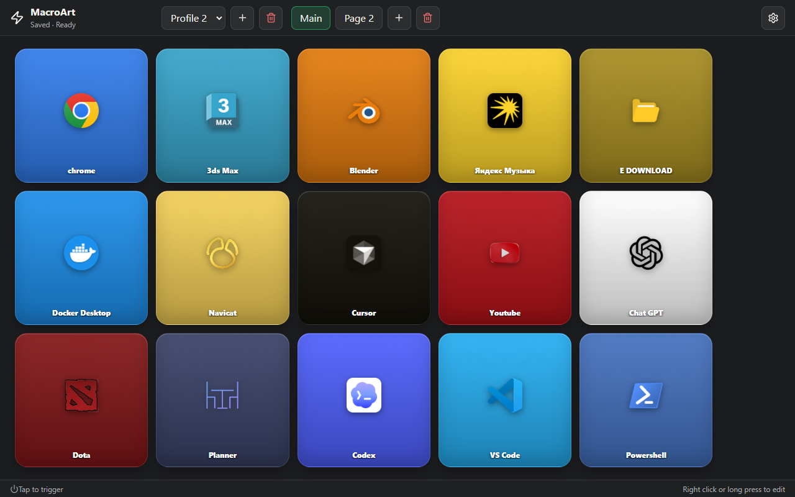
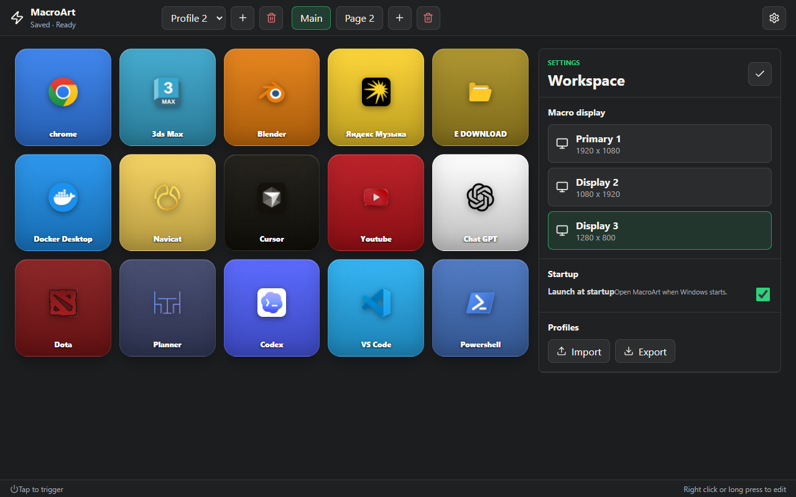

# MacroArt

Windows touch macro deck for a dedicated third monitor.

## Screenshots

### Deck



### Button editor


### Settings



## Development

```powershell
npm install
npm run dev
```

## Build

```powershell
npm run build
npm run dist
```

`npm run dist` creates two Windows release artifacts:

- `release/MacroArt Setup 0.1.0.exe` — installer with Start menu and desktop shortcuts.
- `release/MacroArt Portable 0.1.0.exe` — standalone portable executable.

The packaged app includes `resources/automation/send-hotkey.ahk`. `npm run dist` first runs `scripts/fetch-autohotkey.ps1`, which downloads `AutoHotkey64.exe` into `resources/automation/` so the installer does not depend on a global AutoHotkey install. If the helper is missing during development, MacroArt falls back to Windows PowerShell/WScript SendKeys for basic non-Windows-key shortcuts.
